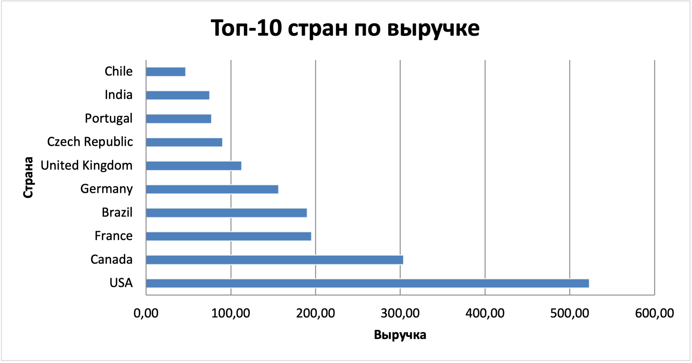
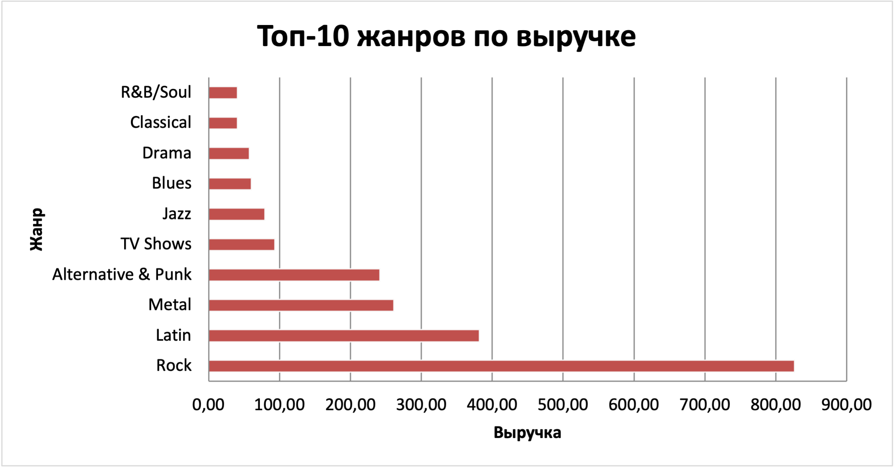
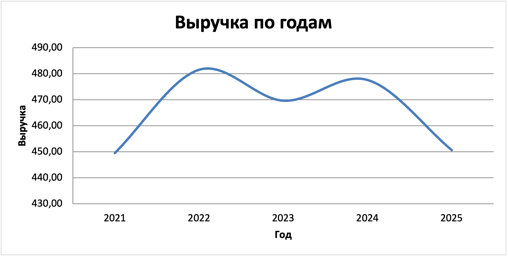
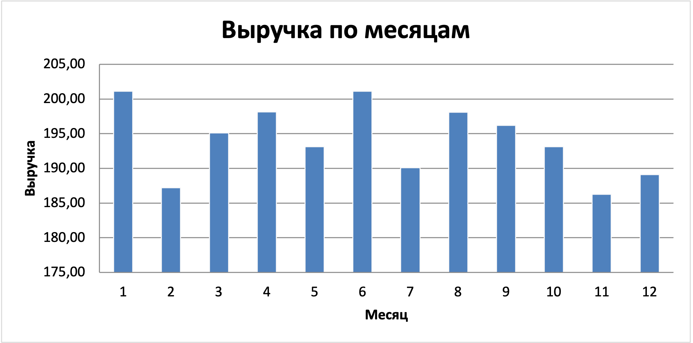

#  Анализ продаж цифрового музыкального магазина (Chinook)

Учебно-портфельный проект по SQL: анализ данных цифрового музыкального магазина
и ответы на бизнес-вопросы — от общей статистики до динамики продаж и рейтингов
с оконными функциями.

---

##  О проекте

Цель проекта — на примере реальной модели данных музыкального магазина показать
навыки работы с SQL: от простых выборок до многотабличных соединений, агрегаций,
работы с датами и оконных функций. Каждый запрос отвечает на конкретный
**бизнес-вопрос**, а не просто демонстрирует синтаксис.

Проект построен по принципу «от простого к сложному» и разбит на три блока.

##  Технологии

| Инструмент | Назначение |
|---|---|
| PostgreSQL 18 | СУБД, выполнение запросов |
| pgAdmin 4 | Графический клиент для работы с базой |
| Chinook Database | Учебный датасет (цифровой музыкальный магазин) |

##  О данных

**Chinook** — открытая учебная база данных, имитирующая цифровой музыкальный магазин.
Содержит 11 связанных таблиц: клиенты, счета и позиции счетов, треки, альбомы,
исполнители, жанры, плейлисты, сотрудники и типы носителей.

Ключевые таблицы, использованные в анализе:
- `customer` — клиенты
- `invoice` — счета (с датой и суммой)
- `invoice_line` — позиции счёта (цена, количество)
- `track` — треки
- `genre` — жанры

##  Структура репозитория

```
chinook-sql-analysis/
├── README.md              — описание проекта (этот файл)
├── queries.sql            — все SQL-запросы с комментариями
├── chinook_charts.xlsx    — исходные данные и графики
└── charts/                — визуализации ключевых результатов
```

---

##  Ход анализа и выводы

### Блок 1. Общая картина

Базовая описательная статистика: масштаб бизнеса и структура каталога.

| Вопрос | Результат |
|---|---|
| Всего клиентов | **59** |
| География клиентов | Лидируют США (13), Канада (8), Франция (5) — всего 24 страны |
| Крупнейшие жанры каталога | Rock (1297 треков), Latin (579), Metal (374) |

**Вывод:** аудитория магазина международная, но сильно сконцентрирована в
Северной Америке. Каталог смещён в сторону рок-музыки.

### Блок 2. Деньги и соединение таблиц (JOIN)

Анализ выручки в разных разрезах — по клиентам, странам и жанрам.

| Вопрос | Результат |
|---|---|
| Топ-клиент | Helena Holý (Прага) — 49.62 |
| Самая прибыльная страна | США — 523.06, далее Канада (303.96), Франция (195.10) |
| Средний чек | ≈ 5.65 |
| Самый прибыльный жанр | Rock — 826.65, далее Latin (382.14), Metal (261.36) |

**Выручка по странам:**



**Выручка по жанрам:**



**Вывод:** география выручки повторяет географию клиентской базы — больше клиентов
означает больше денег. Самый прибыльный жанр совпадает с самым крупным по каталогу
(Rock): в данном магазине объём каталога и выручка идут рука об руку.

### Блок 3. Динамика во времени и оконные функции

Анализ трендов по годам и месяцам, а также построение рейтингов внутри групп.

**Выручка по годам:**

| Год | Выручка |
|---|---|
| 2021 | 449.46 |
| 2022 | 481.45 |
| 2023 | 469.58 |
| 2024 | 477.53 |
| 2025 | 450.58 |



**Вывод:** выручка стабильна, но не растёт — колеблется в узком коридоре ~450–480
в год без выраженного тренда. Для бизнеса это сигнал стагнации: магазин удерживает
позиции, но не развивается.

**Сезонность (выручка по месяцам):**



Разброс между месяцами менее 10% (186–201). Выраженной сезонности нет — продажи
равномерны в течение года, значит магазину не нужно готовиться к сезонным пикам спроса.

**Топ-3 трека в каждом жанре (оконные функции):**
Для рейтинга внутри каждого жанра использованы оконные функции. В части жанров все
треки продались одинаково (по одному разу), из-за чего `RANK()` возвращает больше
трёх строк — это выявило особенность данных. Для строгого топ-3 применён
`ROW_NUMBER()`. В проекте приведены оба варианта, так как они отвечают на чуть
разные вопросы:
- `ROW_NUMBER()` — ровно 3 трека, даже если среди равных выбор произволен;
- `RANK()` — честно показывает всех претендентов при ничьей за место.

---

##  Ключевые выводы проекта

1. **Бизнес в стагнации** — выручка стабильна пять лет подряд, но не растёт.
2. **Сильная зависимость от Северной Америки** — США и Канада дают наибольшую долю выручки.
3. **Rock — ядро бизнеса** и по объёму каталога, и по выручке.
4. **Сезонности нет** — спрос равномерен весь год.

##  Применённые навыки SQL

`SELECT` · `WHERE` · `GROUP BY` · `HAVING` · `ORDER BY` · `LIMIT` ·
агрегатные функции (`COUNT`, `SUM`, `AVG`, `ROUND`) · `JOIN` (в т.ч. цепочки из
нескольких таблиц) · работа с датами (`EXTRACT`) · подзапросы ·
оконные функции (`RANK`, `ROW_NUMBER`, `PARTITION BY`)

##  Как воспроизвести

1. Установить PostgreSQL и pgAdmin.
2. Загрузить базу Chinook (файл `Chinook_PostgreSql.sql`).
3. Открыть `queries.sql` и выполнять запросы по блокам.
